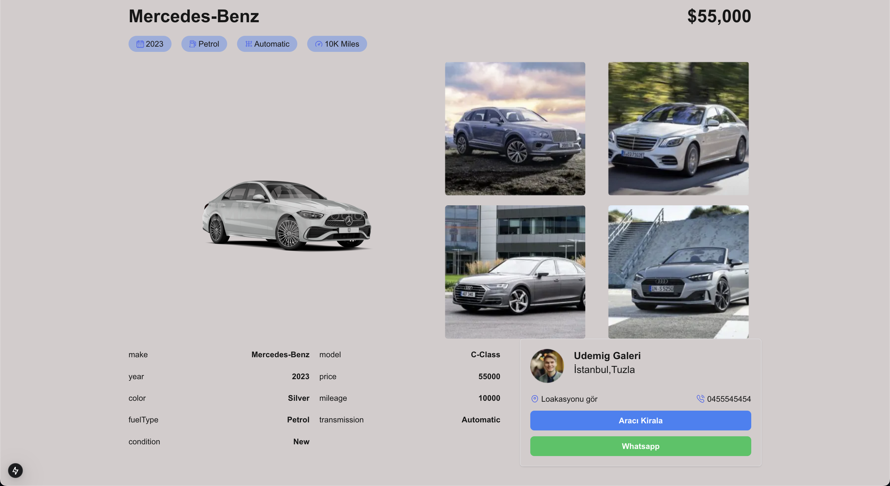
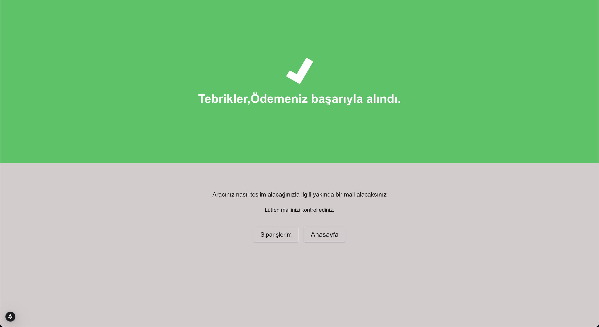

# CarRental Frontend

This is a **Car Rental** web application built using [Next.js](https://nextjs.org/). The application interacts with an external API (backend) to provide car rental services, allowing users to browse, filter, and rent cars.

---

## Screenshots

## screenrecord gif


### home page


### home page 2


### detail page



## success page



## cancel page


## Features

- 🚗 **Car Listings**: Displays a list of available cars for rent.
- 🌐 **API Integration**: Dynamically fetches data from an external API.
- 🎨 **Responsive Design**: Fully responsive UI for mobile, tablet, and desktop.
- 💡 **Optimized Performance**: Leveraging Next.js server-side rendering (SSR) and static site generation (SSG) for fast load times.

---

## Technologies Used

- millify
  A JavaScript library used to format large numbers into human-readable formats.
  For example, it converts 1000000 into 1M.
- mongoose
  A library for MongoDB object modeling, designed to work with asynchronous environments in Node.js.
  It simplifies database interaction and provides schema-based solutions for data modeling, validation, and querying.
- Next.js
  A React-based framework that offers server-side rendering (SSR) and static site generation (SSG) features.
  It enables automatic routing, API routes, and optimizations, making it easier to develop modern web applications.
- Stripe
  A popular API for processing online payments.
  Stripe provides powerful tools for handling payments, subscriptions, and other financial transactions in web and mobile applications.
- Tailwind CSS
  A utility-first CSS framework.
  It provides a fast and flexible way to apply styles directly within HTML using utility classes, making it easy to create responsive and customized designs.
  Tailwind simplifies the styling process by offering pre-configured utility classes for common design tasks.

---

## Installation & Setup

### Prerequisites

- Node.js (version 16 or above recommended)
- npm or yarn

## Installation

1. Clone this repository to your local machine:
   ```
   git clone https://github.com/ozerbaykal/car-rental-next-js.git
   ```
2. ```
   cd car-rental-next-js
   ```
3. ```
   npm run dev
   ```
4. Open your browser and navigate to:
   ```
   http://localhost:3000/
   ```

## Contributing

Contributions are welcome! Please open an issue first to discuss what you would like to change.

- 1.Fork the project
- 2.Create your feature branch (git checkout -b feature/NewFeature)
- 3.Commit your changes (git commit -m 'Add new feature')
- 4.Push to the branch (git push origin feature/NewFeature)
- 5.Open a Pull Request

<h2>Contact</h2>

Özer BAYKAL mail : baykalozer87@gmail.com

Project Link:https://github.com/ozerbaykal/car-rental-next-js
